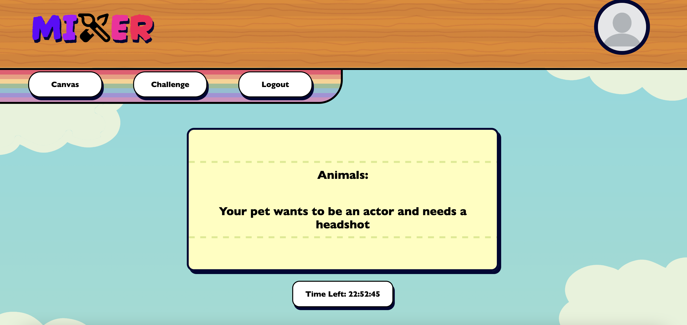
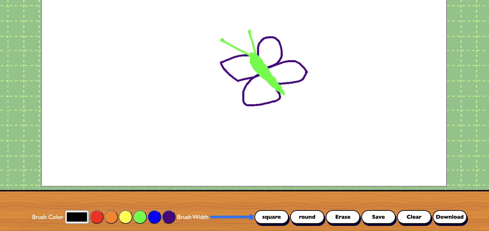
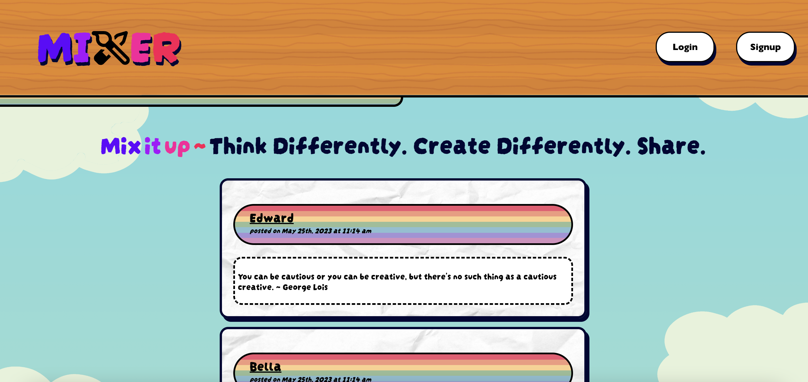

# Mixer

Are you facing artist's block? Our innovative app is designed to provide you with the inspiration you need to overcome creative hurdles. With our app, you'll receive a daily challenge prompt to ignite your imagination. Explore our virtual canvas, where you can freely express your artistic vision and bring your ideas to life.

Moreover, our app fosters a vibrant community of like-minded individuals, enabling you to connect with fellow artists, share your work, and gain valuable feedback.

 Don't let artist's block hold you back—join our app and unleash your creativity today!

See it live on [Heroku!](https://paint-mixer.herokuapp.com/)

## Usage 
Upon visiting our platform, you will be directed to the login page where you have the option to sign up as well. Once logged in, you will be redirected to the homepage where you can find the latest posts. 

In the top left corner, you'll notice the canvas, challenge, and logout tabs. To begin drawing, simply click on the canvas tab. The challenge tab presents our daily draw prompt, designed to inspire and break creative blocks. Only posts associated with the daily challenge will be displayed there. If you would like to contribute a drawing to the challenge, make sure to select the daily challenge checkbox when submitting your artwork. We look forward to seeing your creations!

## Contributors

This project draws inspiration from the University of Minnesota Full Stack Coding Bootcamp and incorporates certain boilerplate code from their curriculum. 

Image made with [contrib.rocks](https://contrib.rocks). 
## License
This repo license is [MIT](https://opensource.org/license/mit/).

## Questions?
Do you have any questions or concerns? Please feel free to reach out to us through our profile pages or by creating an issue on our GitHub repository. We'll be happy to assist you!